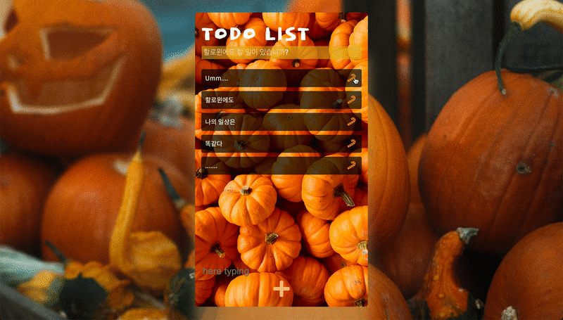
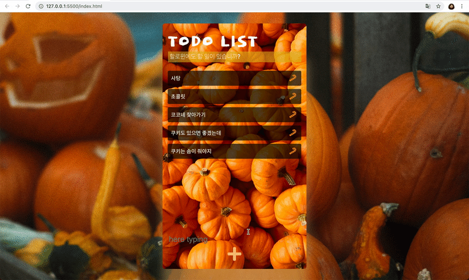

# 할 일 기록
Halloween ver.
  
## 1. Use Tech
</a>
</a>
</a>

## 2. 주요기능

### 1. 첫 화면
>   다가오는 할로윈을 맞이하여 커스텀 해봤습니다.

---
 

### 2. 기록

---
 

### 3. 삭제 

---
 

### 4. localStorage 
>   localStorage를 사용해 저장해 두었기 때문에, 새로고침 후에도 기록이 남아 있습니다.

